# AzamPay Production Webhook & Payment Status Updates

## Overview

In production, payment status updates happen **automatically** through AzamPay webhooks. You do **not** need to manually update payment statuses - the callback endpoint handles everything.

---

## 🧪 Sandbox vs 🚀 Production

### Sandbox (Testing Environment)

```mermaid
sequenceDiagram
    Frontend->>Backend: Initiate Payment
    Backend->>AzamPay: POST /mno/checkout
    AzamPay-->>Backend: transactionId
    Backend-->>Frontend: Payment initiated (PENDING)
    Note over AzamPay,Backend: ⚠️ Webhook may not be sent
    User->>Backend: Check Status (manual)
    Backend->>AzamPay: GET /transactionstatus
    AzamPay-->>Backend: Status
    Backend-->>User: Updated status
```



**Sandbox Limitations**:
- ❌ Webhooks are unreliable or not sent
- ❌ Must manually check status using status endpoint
- ❌ Requires manual intervention for testing
- ✅ Good for testing payment initiation flow

---

### Production (Live Environment)


**Production Advantages**:
- ✅ Automatic webhook sent immediately after payment
- ✅ No manual intervention required
- ✅ Real-time status updates
- ✅ Customer gets instant confirmation

---

## 📍 Webhook Endpoint

### Endpoint Details

**URL**: `POST /api/v1.0/donors/payment/azampay/callback/`

**Authentication**: None (AllowAny - webhooks don't send auth tokens)

**Implementation**: [donor/payments/callback_views.py](../donor/payments/callback_views.py#L20-L180)

### What the Callback Does Automatically

1. **Receives webhook** from AzamPay with payment status
2. **Validates** the callback data structure
3. **Extracts** donation ID from `externalreference` field
4. **Updates donation status**:
   - `success` → `COMPLETED`
   - `failure` → `FAILED`
   - `cancelled` → `CANCELLED`
5. **Updates patient funding** (if donation is for specific patient):
   - Adds donation amount to patient's `funding_received`
   - Checks if patient is now `FULLY_FUNDED`
6. **Logs everything** to `logs/payments.log` and `logs/django.log`
7. **Returns 200 OK** to AzamPay to acknowledge receipt

---

## 🔧 Production Setup

### Step 1: Get Production Credentials

After submitting KYC documents to AzamPay:

1. **Contact AzamPay Support**:
   - Email: support@azampay.com
   - Request production credentials after KYC approval

2. **Receive Production Credentials**:
   - Production Client ID
   - Production Client Secret
   - Production Token
   - Production Vendor ID
   - Webhook Password (ask support for this)

### Step 2: Configure Callback URL in AzamPay Dashboard

**Important**: Configure this **in AzamPay dashboard** after KYC approval.

**Production Callback URL**:
```
https://yourdomain.com/api/v1.0/donors/payment/azampay/callback/
```

**Requirements**:
- ✅ Must be HTTPS (SSL certificate required)
- ✅ Must be publicly accessible (not localhost)
- ✅ Must return 200 OK response
- ✅ Server must not be behind firewall blocking AzamPay IPs

**Where to Configure**:
1. Log in to AzamPay Production Dashboard
2. Navigate to your application settings
3. Find "Callback URL" or "Webhook URL" field
4. Enter your production callback URL
5. Save changes

### Step 3: Update .env for Production

```bash
# Django Settings
DEBUG=False
ALLOWED_HOSTS=yourdomain.com,www.yourdomain.com,185.237.253.223

# CORS (HTTPS only in production)
CORS_ALLOWED_ORIGINS=https://yourdomain.com,https://www.yourdomain.com

# AzamPay Production Endpoints
AZAM_PAY_AUTH=https://authenticator.azampay.co.tz
AZAM_PAY_CHECKOUT_URL=https://checkout.azampay.co.tz

# Production Credentials (from AzamPay)
AZAM_PAY_CLIENT_ID=your_production_client_id
AZAM_PAY_CLIENT_SECRET=your_production_client_secret
TOKEN=your_production_token
AZAMPAY_VENDOR_ID=your_production_vendor_id

# Environment
AZAM_PAY_ENVIRONMENT=production
AZAM_PAY_TIMEOUT_CONNECT=30
AZAM_PAY_TIMEOUT_READ=60

# Webhook Security (from AzamPay support)
AZAM_PAY_WEBHOOK_PASSWORD=your_webhook_password

# Security (MUST be enabled)
CSRF_COOKIE_SECURE=True
SESSION_COOKIE_SECURE=True
SECURE_SSL_REDIRECT=True
SECURE_HSTS_SECONDS=31536000
```

### Step 4: Set Up SSL Certificate

**Required for HTTPS webhook endpoint**

Using Let's Encrypt (Free):
```bash
# Install certbot
sudo apt install certbot python3-certbot-nginx

# Get certificate for your domain
sudo certbot --nginx -d yourdomain.com -d www.yourdomain.com

# Auto-renewal (certbot sets this up automatically)
sudo certbot renew --dry-run
```

### Step 5: Deploy and Test

```bash
# Run deployment checks
python manage.py check --deploy

# Collect static files
python manage.py collectstatic --noinput

# Restart server
sudo systemctl restart gunicorn
sudo systemctl restart nginx
```

---

## 🧪 Testing the Callback

### Test 1: Verify Endpoint is Accessible

From external server or online tool:
```bash
curl -X POST https://yourdomain.com/api/v1.0/donors/payment/azampay/callback/ \
  -H "Content-Type: application/json" \
  -d '{
    "message": "Test webhook",
    "user": "255789123456",
    "password": "",
    "clientId": "test",
    "transactionstatus": "success",
    "operator": "Mpesa",
    "reference": "TEST123",
    "externalreference": "RHCI-DN-999-20251219120000",
    "utilityref": "RHCI-DN-999-20251219120000",
    "amount": "1000",
    "transid": "TEST123",
    "msisdn": "255789123456",
    "mnoreference": "MPE123",
    "submerchantAcc": null,
    "additionalProperties": {}
  }'
```

**Expected Response**:
- 404 (donation not found) = ✅ Endpoint working, just no donation with ID 999
- 401/403 = ❌ Authentication issue (callback should be public)
- Timeout = ❌ Server not accessible or firewall blocking

### Test 2: Check Webhook in Logs

After making a real payment:
```bash
# Watch payment logs in real-time
tail -f logs/payments.log

# Check Django logs
tail -f logs/django.log

# Check for errors
tail -f logs/errors.log
```

**What to Look For**:
```
Received Azam Pay callback: {...}
Processed callback - External ID: RHCI-DN-123-..., Status: SUCCESS
✅ Donation 123 completed successfully
Updated patient funding: 50.00/1000.00
```

### Test 3: Make Small Test Payment

1. Create a small donation (e.g., $1)
2. Complete payment on phone
3. Check logs immediately
4. Verify donation status updated in database
5. Verify patient funding updated (if applicable)

---

## 📊 Monitoring Production Webhooks

### View Recent Callbacks

```bash
# Last 50 webhook callbacks
grep "Received Azam Pay callback" logs/payments.log | tail -50

# Successful payments today
grep "completed successfully" logs/payments.log | grep "$(date +%Y-%m-%d)"

# Failed payments
grep "payment failed" logs/payments.log
```

### Database Queries

```python
# Django shell
python manage.py shell

from donor.models import Donation
from django.utils import timezone
from datetime import timedelta

# Donations completed today
today = timezone.now().date()
completed_today = Donation.objects.filter(
    status='COMPLETED',
    completed_at__date=today
)
print(f"Completed today: {completed_today.count()}")

# Pending donations (older than 10 minutes)
ten_mins_ago = timezone.now() - timedelta(minutes=10)
stuck_pending = Donation.objects.filter(
    status='PENDING',
    created_at__lt=ten_mins_ago
)
print(f"Stuck pending: {stuck_pending.count()}")
for d in stuck_pending:
    print(f"  ID: {d.id}, Created: {d.created_at}")
```

---

## 🔍 Troubleshooting

### Issue 1: Webhook Not Received

**Symptoms**:
- Payment shows PENDING for more than 5 minutes
- No callback logged in `logs/payments.log`
- Customer says payment was successful

**Checks**:
1. **Verify callback URL configured in AzamPay dashboard**
   - Should be: `https://yourdomain.com/api/v1.0/donors/payment/azampay/callback/`
   - Must be HTTPS
   - Must be production URL (not sandbox URL)

2. **Check server is accessible**:
   ```bash
   # From external server
   curl -I https://yourdomain.com/api/v1.0/donors/payment/azampay/callback/
   ```

3. **Check firewall rules**:
   ```bash
   # Allow HTTPS
   sudo ufw allow 443/tcp
   
   # Check if port is open
   sudo netstat -tulpn | grep :443
   ```

4. **Check nginx/apache logs**:
   ```bash
   sudo tail -f /var/log/nginx/access.log
   sudo tail -f /var/log/nginx/error.log
   ```

5. **Contact AzamPay support**:
   - Verify webhook is being sent
   - Ask for webhook delivery logs
   - Confirm callback URL configuration

**Solution**:
- Manually check status using status endpoint
- Or contact AzamPay support for webhook retry

---

### Issue 2: Webhook Returns 401/403

**Symptoms**:
- AzamPay shows webhook failed with 401/403 error
- Logs show authentication error

**Cause**:
- Callback endpoint requires authentication
- JWT middleware intercepting the request

**Fix**:

Verify in [callback_views.py](../donor/payments/callback_views.py#L24):
```python
class AzamPayCallbackView(APIView):
    permission_classes = [AllowAny]  # ✅ Must be AllowAny
```

If it's not `AllowAny`, the webhook will be blocked.

---

### Issue 3: Donation Not Found

**Symptoms**:
- Webhook received
- Error: "Could not find donation from external_id: RHCI-DN-..."

**Cause**:
- Donation ID in `externalreference` doesn't exist in database
- External reference format is wrong

**Check**:
```bash
# Check if donation exists
python manage.py shell -c "
from donor.models import Donation
external_ref = 'RHCI-DN-123-20251219120000'
donation_id = int(external_ref.split('-')[2])
try:
    d = Donation.objects.get(id=donation_id)
    print(f'Found: {d.id}, Status: {d.status}')
except Donation.DoesNotExist:
    print('Donation not found')
"
```

**Solution**:
- Ensure payment initiation creates donation before redirecting
- Check external reference format matches: `RHCI-DN-{id}-{timestamp}`

---

### Issue 4: Status Not Updating

**Symptoms**:
- Webhook received and logged
- Donation still shows PENDING
- No errors in logs

**Check Database Transaction**:

Look for this in logs:
```
✅ Donation 123 completed successfully
```

If missing, check:
1. **Transaction not committed**:
   - Database deadlock
   - Transaction timeout
   - Database connection error

2. **Check database directly**:
   ```bash
   mysql -u rhci_portal_admin -p rhci_portal_db_v1
   
   SELECT id, status, completed_at, amount 
   FROM donor_donation 
   WHERE id = 123;
   ```

3. **Check for exceptions**:
   ```bash
   grep "Error processing Azam Pay callback" logs/payments.log
   ```

---

## 📚 Related Documentation

- [AzamPay Integration Guide](./AZAMPAY_INTEGRATION.md)
- [AzamPay Quick Start](./AZAMPAY_QUICK_START.md)
- [CORS Deployment Guide](./DEPLOYMENT_CORS.md)
- [Production Environment Setup](./.env.production.example)

---

## 🆘 Support Contacts

**AzamPay Support**:
- Email: support@azampay.com
- Developer Portal: https://developers.azampay.co.tz/
- Documentation: https://developerdocs.azampay.co.tz/

**Common Requests**:
- Production credentials after KYC approval
- Webhook password for authentication
- Webhook delivery logs/debugging
- IP whitelist (if needed)
- Callback URL configuration assistance

---

## 📝 Summary

### In Production:

✅ **Webhooks work automatically** - AzamPay sends callback when payment completes  
✅ **No manual updates needed** - Status updates happen automatically  
✅ **Real-time updates** - Customer sees confirmation immediately  
✅ **Patient funding updates** - Totals updated automatically  
✅ **Fully logged** - All webhook activity tracked in logs  

### Key Requirements:

1. ✅ HTTPS enabled (SSL certificate)
2. ✅ Callback URL configured in AzamPay dashboard
3. ✅ Server publicly accessible
4. ✅ Production credentials from AzamPay
5. ✅ Endpoint has `AllowAny` permissions

### Monitoring:

```bash
# Watch real-time callbacks
tail -f logs/payments.log | grep "callback"

# Check today's completed payments
python manage.py shell -c "
from donor.models import Donation
from django.utils import timezone
today = timezone.now().date()
count = Donation.objects.filter(status='COMPLETED', completed_at__date=today).count()
print(f'Completed today: {count}')
"
```

---

**Last Updated**: December 19, 2025  
**Status**: ✅ Production Ready
